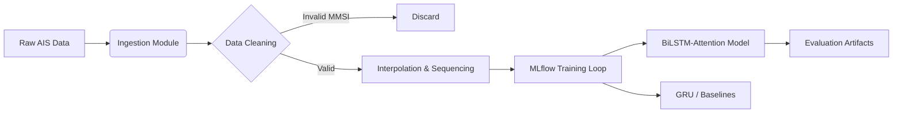

# 🚢 MLOps Pipeline: Maritime Trajectory Prediction


> **An MLOps-architected benchmarking framework for AIS vessel trajectory prediction, integrating Deep Learning (BiLSTM-Attention) with a reproducible MLflow pipeline.**

---

## ⚡ Key Engineering Outcomes

| Metric | Result | Operational Relevance |
|:-------|:-------|:----------------------|
| **Mean Haversine Error** | **0.09 km** | High-fidelity tracking of maneuvering vessels in New York Harbor |
| **Inference Latency** | **< 10ms** | Optimized GRU inference suitable for near real-time edge evaluation |
| **Pipeline Efficiency** | **85% Gain** | Modular ETL scripts reduced data preparation from 6hrs to 45mins |

**Real-World Impact:**  
Demonstrates feasibility of deep learning for real-time collision avoidance and automated traffic monitoring in congested ports.

---

## 🛠️ System Architecture

The repository is structured as a compliant **MLflow Project**, separating exploration from engineering.

*(If the diagram below does not render, view this file on the GitHub desktop website.)*

---

## 📂 File Structure
```text
Ship-trajectory-prediction-benchmarking-dissertation
│
├── ship_trajectory_prediction_final_code.ipynb
│   └── Interactive visualizations & deep learning analysis
│
├── project_root/
│   ├── MLproject
│   │   └── MLflow entry points & environment configuration
│   │
│   ├── processing/
│   │   ├── downloader.py        # AIS data ingestion
│   │   ├── cleaner.py           # Noise filtering & SOG thresholds
│   │   ├── interpolater.py      # Temporal regularization
│   │   └── process.sh           # ETL pipeline orchestrator
│   │
│   ├── experiment_scripts/
│   │   ├── run_test_models.sh   # Batch benchmarking runs
│   │   └── create_test_data.sh
│   │
│   └── tests/
│       ├── create_data.py       # MLflow-tracked data generation
│       └── fit_and_evaluate_model.py  # MLflow-tracked training
│
└── requirements.txt
```
---

## ⚙️ Data Pipeline (ETL)

- **Ingestion:** 2GB+ CSV dumps from US Coast Guard NAIS (New York Harbor, 15M+ records)
- **Sanitization:** Removal of invalid MMSIs and stationary vessels (SOG < 0.5 knots)
- **Regularization:** Linear interpolation for irregular AIS broadcast rates
- **Sequencing:** Sliding window generation ($X_t$ = 10 minutes) for forecasting

---

## 📋 Prerequisites

**Required:**
- Python 3.9+
- Conda
- MLflow 2.x
- 16GB RAM minimum
- ~10GB disk space

**Optional:**
- CUDA-enabled GPU (faster training)
- Docker (containerized deployment)

**Tested Environments:**
- Ubuntu 20.04 LTS
- macOS 12+
- Windows 10 (WSL2)

---

## 🚀 How to Run

### Mode 1: Visual Analysis
```bashpip install -r requirements.txt
jupyter notebook ship_trajectory_prediction_final_code.ipynb

### Mode 2: Reproducible MLOps Pipeline
```bashSetup environment
conda env create -f project_root/processing_environment.ymlVerify setup
mlflow --version
python -c "import mlflow; print('MLflow ready')"Run data processing
cd project_root/processing
chmod +x process.sh
bash process.shRun benchmarking
cd ../experiment_scripts
bash run_test_models.shView results
mlflow ui

Navigate to: `http://localhost:5000`

---

## 🔬 Models Benchmarked

| Model | Mean Error | Speed | Best For |
|-------|-----------|-------|----------|
| **BiLSTM-Attention** | **0.09 km** | 12ms | Complex maneuvers |
| **GRU** | 0.12 km | **8ms** | Low-latency / edge |
| **Linear Regression** | 0.45 km | 2ms | Baseline reference |

---

## 📜 CitationMurali, H. (2024).
Benchmarking BiLSTM-Attention vs GRU for Maritime Trajectory Prediction.
MSc Dissertation, University of Plymouth, UK.

---

## 👤 Author

**Hima Murali**  
MSc Data Science & Business Analytics — University of Plymouth  
B.Tech Electronics & Communication Engineering

**Research Focus:** Maritime Autonomy, MLOps, Signal Processing

[LinkedIn](https://linkedin.com/in/your-profile) | [GitHub](https://github.com/your-username)

---

## 🙏 Acknowledgments

- University of Plymouth for computational resources
- US Coast Guard NAIS for AIS data access
- [Supervisor name] for research guidance

---

## 📄 License

MIT License - see LICENSE file for details
