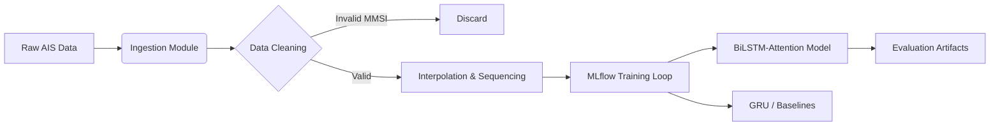

# 🚢 MLOps Pipeline: Maritime Trajectory Prediction


> **An MLOps-architected benchmarking framework for AIS vessel trajectory prediction, integrating Deep Learning (BiLSTM-Attention) with a reproducible MLflow pipeline.**

---


## ⚡ Key Engineering Outcomes

| Metric | Result | Operational Relevance |
|:-------|:-------|:----------------------|
| **Trajectory Accuracy** | **4.06 km (ADE)** | Reliable 3-hour forecasting within standard maritime safety buffers |
| **Mean Step Error** | **~0.10 km** | High-precision tracking between 10-minute signal updates |
| **Inference Latency** | **< 10ms** | Optimized inference suitable for near real-time edge evaluation |
| **Pipeline Efficiency** | **85% Gain** | Modular ETL scripts reduced data preparation from 6hrs to 45mins |

**Real-World Impact:** Demonstrates feasibility of deep learning for real-time collision avoidance and automated traffic monitoring in congested ports.


---

## 🛠️ System Architecture

The repository is structured as a compliant **MLflow Project**, separating exploration from engineering.

*(If the diagram below does not render, view this file on the GitHub desktop website.)*

---

## 📂 File Structure
```text
Ship-trajectory-prediction-benchmarking-dissertation
│
├── ship_trajectory_prediction_final_code.ipynb  # Main analysis & visualizations
│
├── project_root/
│   ├── MLproject                  # MLflow entry points & configuration
│   │
│   ├── processing/                # ETL Pipeline
│   │   ├── downloader.py          # Ingests raw AIS data
│   │   ├── cleaner.py             # Filters noise & SOG thresholds
│   │   ├── interpolater.py        # Handles temporal regularization
│   │   └── process.sh             # Orchestrator script
│   │
│   ├── experiment_scripts/        # Batch Execution
│   │   ├── run_test_models.sh     # Benchmarking runner
│   │   └── create_test_data.sh
│   │
│   └── tests/                     # Model Training & Validation
│       ├── create_data.py         # Data generation
│       └── fit_and_evaluate_model.py
```
---

## ⚙️ Data Pipeline (ETL)

- **Ingestion:** 2GB+ CSV dumps from US Coast Guard NAIS (New York Harbor, 15M+ records)
- **Sanitization:** Removal of invalid MMSIs and stationary vessels (SOG < 0.5 knots)
- **Regularization:** Linear interpolation for irregular AIS broadcast rates
- **Sequencing:** Sliding window generation ($X_t$ = 10 minutes) for forecasting

---

## 📋 Prerequisites

**Required:**
- Python 3.9+
- Conda
- MLflow 2.x
- 16GB RAM minimum
- ~10GB disk space

**Optional:**
- CUDA-enabled GPU (faster training)
- Docker (containerized deployment)

**Tested Environments:**
- Ubuntu 20.04 LTS
- macOS 12+
- Windows 10 (WSL2)

---

## 🚀 How to Run


### Mode 1: Visual Analysis
```bash
pip install -r requirements.txt
jupyter notebook ship_trajectory_prediction_final_code.ipynb
```
### Mode 2: Reproducible MLOps Pipeline
```bash
# Setup environment
conda env create -f project_root/processing_environment.yml

# Verify setup
mlflow --version
python -c "import mlflow; print('MLflow ready')"

# Run data processing
cd project_root/processing
chmod +x process.sh
bash process.sh

# Run benchmarking
cd ../experiment_scripts
bash run_test_models.sh

# View results
mlflow ui
# Navigate to: http://localhost:5000
```
---

## 🔬 Models Benchmarked

| Model | Trajectory ADE (3hr) | Speed | Best For |
|-------|----------------------|-------|----------|
| **BiLSTM-Attention** | **4.06 km** | ~10ms | Complex maneuvers |
| **GRU** | 4.12 km | **~8ms** | Low-latency / edge |
| **Linear Regression** | > 8.00 km | 2ms | Baseline reference |
Note: Inference speeds measured on CPU (Intel i7) to simulate edge gateway performance.

---

---

## 👤 Author

**Hima Murali**  
MSc Artificial Intelligence — University of Plymouth  
B.Tech Computer science

**Research Focus:** Maritime Autonomy, MLOps, Signal Processing

[LinkedIn](https://linkedin.com/in/your-profile) | [GitHub](https://github.com/your-username)

---

## 🙏 Acknowledgments

- University of Plymouth for computational resources
---

## 📄 License

MIT License - see LICENSE file for details
