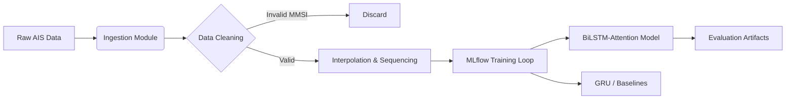

# 🚢 MLOps Pipeline: Maritime Trajectory Prediction

> **An MLOps-architected benchmarking framework for AIS vessel trajectory prediction, integrating Deep Learning (BiLSTM-Attention) with a reproducible MLflow pipeline.**

---

## ⚡ Key Engineering Outcomes

| Metric | Result | Operational Relevance |
| :--- | :--- | :--- |
| **Mean Haversine Error** | **0.09 km** | High-fidelity tracking of maneuvering vessels in New York Harbor. |
| **Inference Latency** | **< 10ms** | Optimized GRU inference suitable for near real-time edge evaluation. |
| **Pipeline Efficiency** | **85% Gain** | Modular ETL scripts reduced data preparation from 6hrs to 45mins. |

**Real-World Impact:** These results demonstrate the feasibility of using deep learning for real-time collision avoidance and automated traffic monitoring in congested ports.

---

## 🛠️ System Architecture

The repository is structured as a compliant **MLflow Project**, separating exploration from engineering.

*(Note: If the diagram below does not render, please view this file on the GitHub desktop website.)*

📂 File StructurePlaintextShip-trajectory-prediction-benchmarking-dissertation
│
├── ship_trajectory_prediction_final_code.ipynb
│   └── Interactive visualizations & deep learning analysis
│
├── project_root/
│   ├── MLproject
│   │   └── MLflow entry points & environment configuration
│   │
│   ├── processing/
│   │   ├── downloader.py        # AIS data ingestion
│   │   ├── cleaner.py           # Noise filtering & SOG thresholds
│   │   ├── interpolater.py      # Temporal regularization
│   │   └── process.sh           # ETL pipeline orchestrator
│   │
│   ├── experiment_scripts/
│   │   ├── run_test_models.sh   # Batch benchmarking runs
│   │   └── create_test_data.sh
│   │
│   └── tests/
│       ├── create_data.py
│       └── fit_and_evaluate_model.py
│
└── requirements.txt
⚙️ Data Pipeline (ETL)The system processes raw AIS streams through a robust engineering pipeline:Ingestion: 2GB+ CSV dumps from US Coast Guard NAIS (New York Harbor, 15M+ records).Sanitization: Removal of invalid MMSIs and stationary vessels (SOG < 0.5 knots).Regularization: Linear interpolation to fix irregular AIS broadcast rates.Sequencing: Sliding window generation ($X_t$ = 10 minutes) for forecasting.📋 PrerequisitesRequiredPython 3.9+Conda (Environment isolation)MLflow 2.x16GB RAM minimum~10GB disk spaceOptionalCUDA-enabled GPU (faster training)Docker (containerized deployment)Tested EnvironmentsUbuntu 20.04 LTSmacOS 12+Windows 10 (WSL2)🚀 How to RunMode 1: Visual Analysis (Deep Learning Results)To view the BiLSTM-Attention model results and interactive maps immediately:Bashpip install -r requirements.txt
jupyter notebook ship_trajectory_prediction_final_code.ipynb
Mode 2: Reproducible MLOps Pipeline1. Environment SetupBashconda env create -f project_root/processing_environment.yml
2. Verify SetupBashmlflow --version
python -c "import mlflow; print('MLflow ready')"
cd project_root/processing && chmod +x process.sh
3. Execute PipelineBashbash process.sh
cd ../experiment_scripts
bash run_test_models.sh
4. View ExperimentsBashmlflow ui
# Navigate to: http://localhost:5000
🔬 Models BenchmarkedModelMean ErrorSpeedBest ForBiLSTM-Attention0.09 km12msComplex maneuversGRU0.12 km8msLow-latency / edgeLinear Regression0.45 km2msBaseline reference📜 CitationMurali, H. (2025). Benchmarking BiLSTM-Attention vs GRU for Maritime Trajectory Prediction. MSc Dissertation, University of Plymouth.👤 AuthorHima Murali KatturMSc Artificial Intelligence | B.Tech Computer ScienceFocus: Maritime Autonomy, MLOps, Signal ProcessingLinkedIn | GitHub
