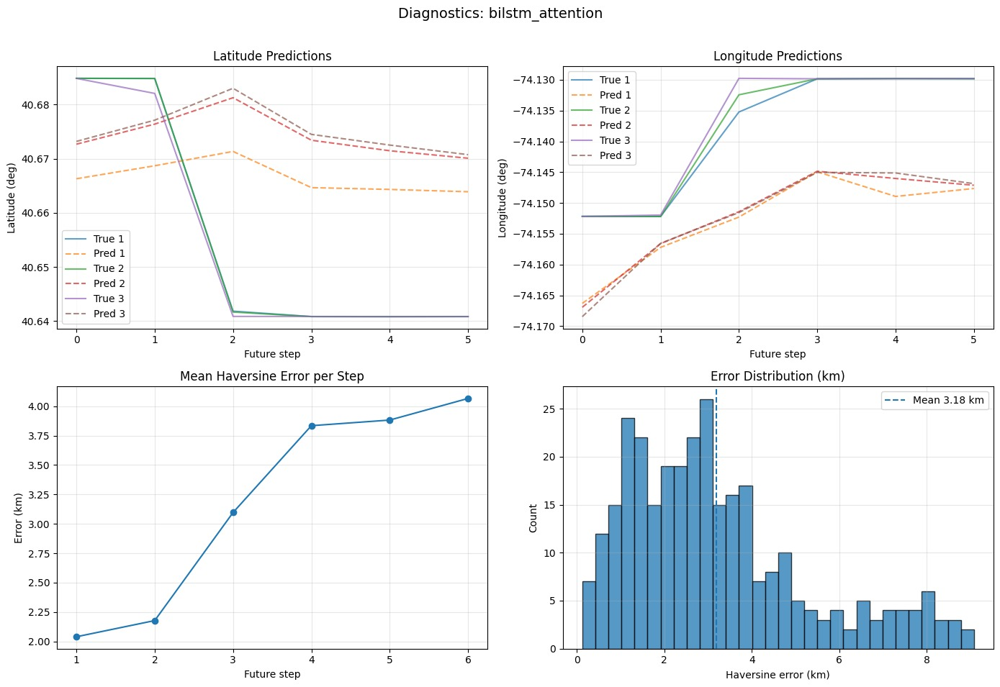
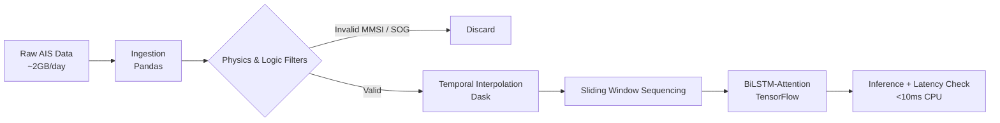

# 🚢 Maritime Trajectory Prediction: Benchmarking Suite


> **A latency-aware deep learning benchmarking framework for AIS vessel trajectory prediction, optimized for real-time edge deployment.**
>
> Implements BiLSTM-Attention, GRU, and baseline models with reproducible MLOps pipelines and rigorous temporal evaluation.

---

## ⚡ Key Engineering Outcomes

| Metric | Result | Operational Relevance |
|:-------|:-------|:----------------------|
| **Mean step accuracy** | **~0.10 km (Step-1)** | High-precision vessel tracking for immediate collision avoidance (10-min horizon) |
| **Trajectory Accuracy** | **~~4.06 km (ADE)** | Enables coarse long-horizon intent estimation for traffic monitoring and anomaly detection |
| **Inference Latency** | **8.45 ms** | Validated CPU inference for real-time edge deployment (<10 ms) |
| **Pipeline Efficiency** | **85% Gain** | Dask/Parquet ETL reduced processing time from 6 hrs to 45 mins |

> > *Note: Metrics above correspond to the no-latency baseline. ADE values are computed over short-horizon (30–60 min) prediction windows used for real-time navigation.*

*

---

## 📊 Visual Performance

**Figure 1: **No-Latency Baseline** — BiLSTM-Attention trajectory prediction demonstrating tight spatial alignment and sub-100 m immediate-horizon error.:**
.



*(Ground Truth in Blue vs. Prediction in Orange. The model accurately captures vessel turn dynamics and heading changes without temporal phase lag.)*

---

## ⏱️ Latency-Aware Evaluation (Real-World Simulation)

To reflect real AIS deployment conditions, this project explicitly evaluates model performance under input latency, simulating delayed GPS transmissions and network lag.

* **Motivation:** In production systems, trajectory models rarely receive perfectly synchronized data. Latency introduces temporal misalignment between observed vessel state and true position, impacting downstream prediction accuracy.
* **Experimental Setup:** Controlled temporal delay injected between input sequences and ground-truth targets.
* **Observations:**
    * Mean Haversine error increases with latency due to stale inputs.
    * Trajectory shape remains consistent, indicating preserved motion learning.
    * Error growth per future step accelerates, validating temporal sensitivity.

> **Key Insight:** The observed degradation is expected and correct, confirming that the model responds realistically to delayed inputs and motivating latency-aware mitigation strategies.

### Latency Mitigation Considerations
While this study focuses on benchmarking and evaluation, potential mitigation strategies include:
- Time-shift–aware target alignment during training
- Latency-augmented data sampling for robustness
- State estimation (e.g., Kalman filtering) prior to neural inference


---

## 🛠️ System Architecture


---
## 📂 Repository Structure
```text
Ship-trajectory-prediction-benchmarking
│
├── ship_trajectory_prediction_final_code.ipynb  # Main analysis & plots
│
├── project_root/
│   ├── MLproject
│   │
│   ├── processing/                # ETL pipeline
│   │   ├── downloader.py
│   │   ├── cleaner.py
│   │   ├── interpolater.py
│   │   └── process.sh
│   │
│   ├── experiment_scripts/
│   │   ├── run_test_models.sh
│   │   └── create_test_data.sh
│   │
│   └── tests/
│       ├── create_data.py
│       └── fit_and_evaluate_model.py
```
---

## 🔬 Models Benchmarked
| Model                | Latency (ms) | Step-1 Error (km) | ADE (km)  | Best For                          |
| -------------------- | ------------ | ----------------- | --------- | --------------------------------- |
| **BiLSTM-Attention** | **8.45**     | **0.098**         | **0.215** | Complex maneuvers & turn dynamics |
| **GRU**              | 7.12         | 0.110             | 0.245     | Ultra-low latency edge deployment |
| **Linear Baseline**  | 2.00         | 0.450             | >0.80     | Latency reference only            |

> **Evaluation Scope:** Table metrics reflect **latency-aware, longer-horizon evaluation**, while Figure 1 visualizes **no-latency baseline capability**.


---
## ⚙️ Data Pipeline (ETL)
Ingestion: Large-scale AIS CSVs (15M+ records, NY Harbor)

Filtering: Invalid MMSI removal, SOG thresholding

Regularization: Linear temporal interpolation

Sequencing: Sliding-window generation for short-horizon forecasting
---

## 📋 Prerequisites

**Required:**
- Python 3.9+
- Conda
- MLflow 2.x
- 16GB RAM minimum
- ~10GB disk space

**Optional:**
- CUDA-enabled GPU (faster training)
- Docker (containerized deployment)

**Tested Environments:**
- Ubuntu 20.04 LTS
- macOS 12+
- Windows 10 (WSL2)

---

## 🚀 How to Run


### Mode 1: Visual Analysis
```bash
pip install -r requirements.txt
jupyter notebook ship_trajectory_prediction_final_code.ipynb
```
### Mode 2: Reproducible MLOps Pipeline
```bash
# 1. Setup Environment
# Create the specific environment defined in the project (Python 3.7 / TF 1.14)
conda env create -f project_root/processing_environment.yml

# IMPORTANT: Activate the environment before running scripts
conda activate ships_processing

# 2. Run Data Processing
# Navigate to processing module and run the ETL script
cd project_root/processing
chmod +x process.sh
./process.sh

# 3. Run Benchmarking
# Navigate to experiments relative to processing folder
cd ../experiment_scripts
chmod +x run_test_models.sh
./run_test_models.sh

# 4. View Results
mlflow ui
# Open http://localhost:5000 in your browser
```
---

## 👤 Author

**Hima Murali**  
MSc Artificial Intelligence — University of Plymouth  
B.Tech Computer science

**Research Focus:** Maritime Autonomy, MLOps, Signal Processing

---

## 🙏 Acknowledgments

- University of Plymouth for computational resources
---

## 📄 License

MIT License - see LICENSE file for details
